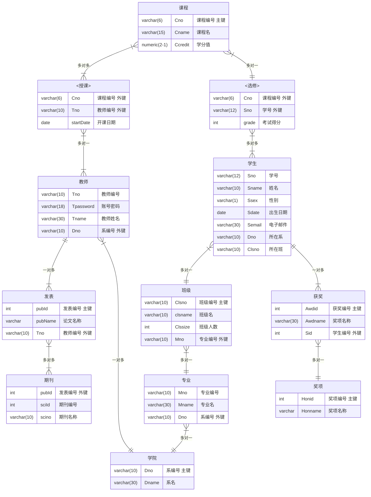

# SmsDB_PHP

功能介绍：

主要实现了对于学生和老师的管理，以下为主要功能：

学生管理

- 新增学生
- 查询学生以及修改学生信息
- 查询以及增加和删除学生获奖信息
  1. 输入信息点击查询按钮即可查询学生信息，后面带有修改选项，点击修改即可修改学生获奖信息
  2. 点击新增即可增加学生获奖信息

教师管理

- 查询老师以及修改授课信息
- 查询教师发表期刊信息

学生选课

- 查询学生并修改选课信息（增加或者查询后修改）
- 查询学生选课对应的成绩

系统设置

- 修改学生密码（输入账号后输入新密码即可修改密码，不需要对照原密码）
- 修改教师密码（同上）

执行建表命令

```sql
CREATE TABLE dept (
    Dno VARCHAR(10) PRIMARY KEY,
    Dname VARCHAR(30) NOT NULL
);

CREATE TABLE major (
    Mno VARCHAR(10) PRIMARY KEY,
    Mname VARCHAR(30) NOT NULL,
    Dno VARCHAR(10),
    FOREIGN KEY (Dno) REFERENCES dept(Dno)
);

CREATE TABLE classes (
    Clsno VARCHAR(10) PRIMARY KEY,
    clsname VARCHAR(10) NOT NULL,
    Clssize INT,
    Mno VARCHAR(10),
    FOREIGN KEY (Mno) REFERENCES major(Mno)
);

CREATE TABLE student (
    Sno VARCHAR(12) PRIMARY KEY,
    Sname VARCHAR(10) NOT NULL,
    Ssex VARCHAR(1) NOT NULL,
    Sdate DATE,
    Semail VARCHAR(30),
    Dno VARCHAR(10),
    Mno varchar(10),
    Clsno VARCHAR(10),
    FOREIGN KEY (Dno) REFERENCES dept(Dno),
    FOREIGN KEY (Mno) REFERENCES major(Mno),
    FOREIGN KEY (Clsno) REFERENCES classes(Clsno)
);

CREATE TABLE course (
    Cno VARCHAR(6) PRIMARY KEY,
    Cname VARCHAR(15) NOT NULL,
    Ccredit DECIMAL(2,1) NOT NULL
);

CREATE TABLE teacher (
    Tno VARCHAR(10) PRIMARY KEY,
    Tpassword VARCHAR(18) NOT NULL,
    Tname VARCHAR(30) NOT NULL,
    Dno VARCHAR(10),
    FOREIGN KEY (Dno) REFERENCES dept(Dno)
);

CREATE TABLE giveLessons (
    Cno VARCHAR(6),
    Tno VARCHAR(10),
    startDate DATE,
    PRIMARY KEY (Cno, Tno),
    FOREIGN KEY (Cno) REFERENCES course(Cno),
    FOREIGN KEY (Tno) REFERENCES teacher(Tno)
);

CREATE TABLE electives (
    Cno VARCHAR(6),
    Sno VARCHAR(12),
    grade INT,
    PRIMARY KEY (Cno, Sno),
    FOREIGN KEY (Cno) REFERENCES course(Cno),
    FOREIGN KEY (Sno) REFERENCES student(Sno)
);

CREATE TABLE awd (
    Awdid INT PRIMARY KEY AUTO_INCREMENT,
    Awdname VARCHAR(30) NOT NULL,
    Sno VARCHAR(12),
    FOREIGN KEY (Sno) REFERENCES student(Sno)
);

CREATE TABLE honors (
    Honid INT PRIMARY KEY AUTO_INCREMENT,
    Honname VARCHAR(30) NOT NULL
);

CREATE TABLE public (
    pubId INT PRIMARY KEY AUTO_INCREMENT,
    pubName VARCHAR(30) NOT NULL,
    Tno VARCHAR(10),
    FOREIGN KEY (Tno) REFERENCES teacher(Tno)
);

CREATE TABLE sci (
    pubId INT,
    sciId INT PRIMARY KEY AUTO_INCREMENT,
    scino VARCHAR(30) NOT NULL,
    FOREIGN KEY (pubId) REFERENCES public(pubId)
);
```

e-r图



